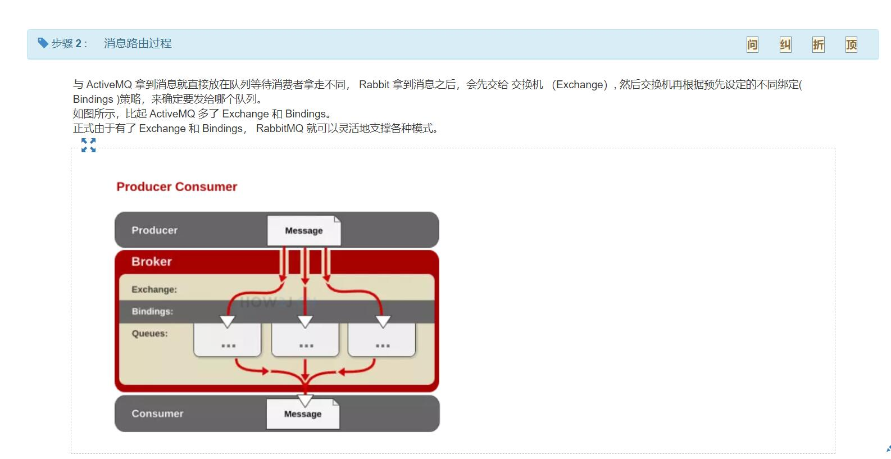
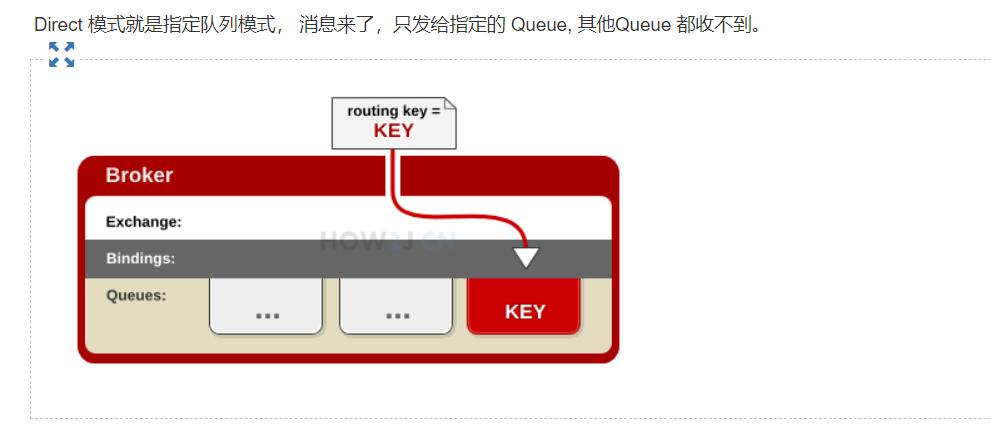
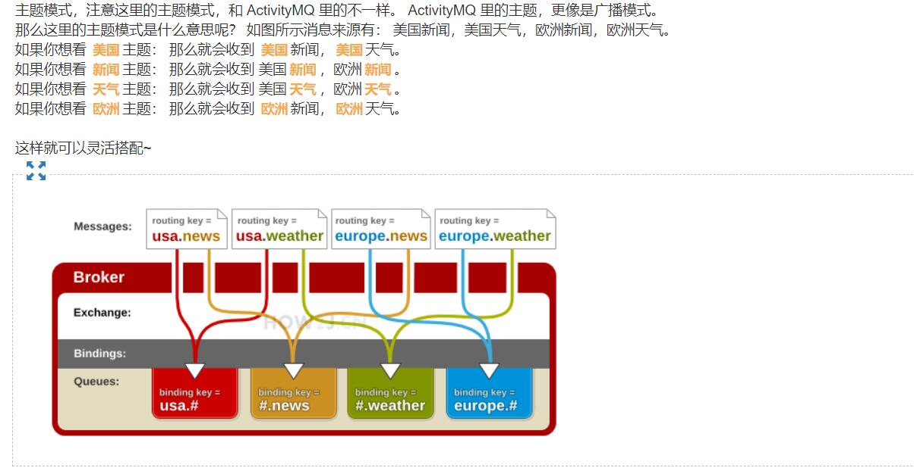

## Rabbitmq
与 ActiveMQ 一样， Rabbitmq 也是一种 消息中间件的实现。与之的区别在于， rabbitmq 更专业，更灵活，
大企业，大型高要求的应用，普遍会采用 rabbitmq 来支持，所以我们还是需要掌握它滴。
    
### 消息路由过程

### 模式
RabbitMQ提供了四种Exchange模式：fanout,direct,topic,header 。 header模式在实际使用中较少，这里只讨论前三种模式.  

